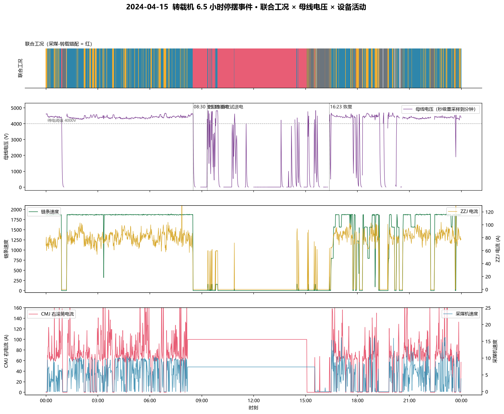
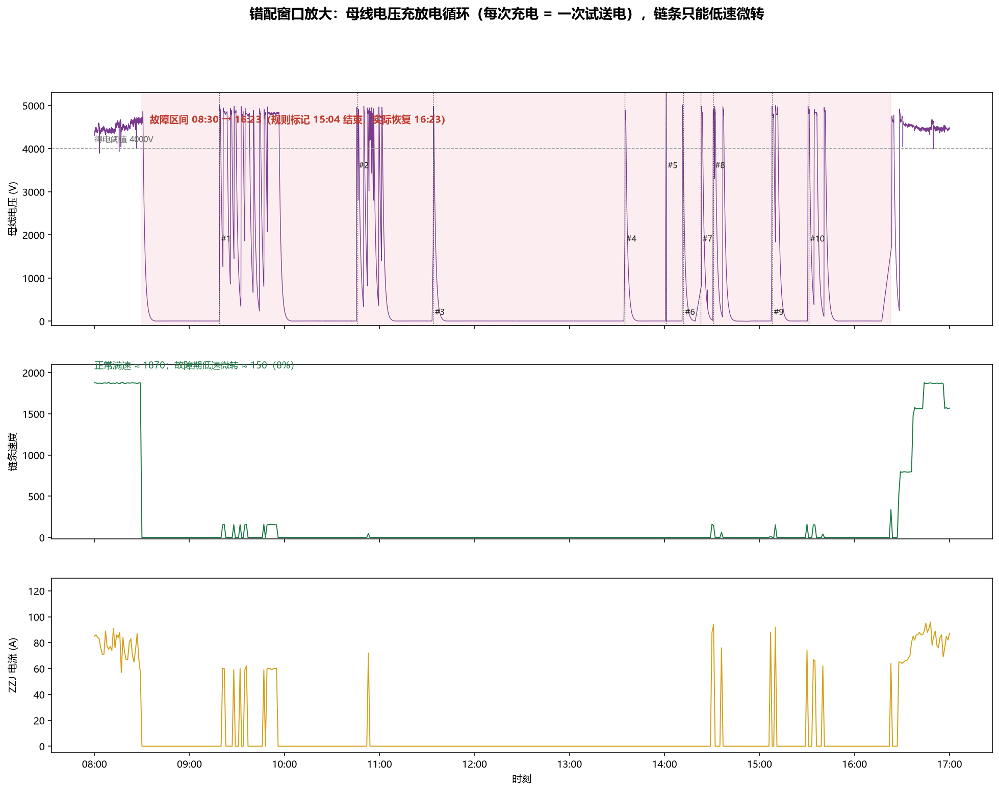
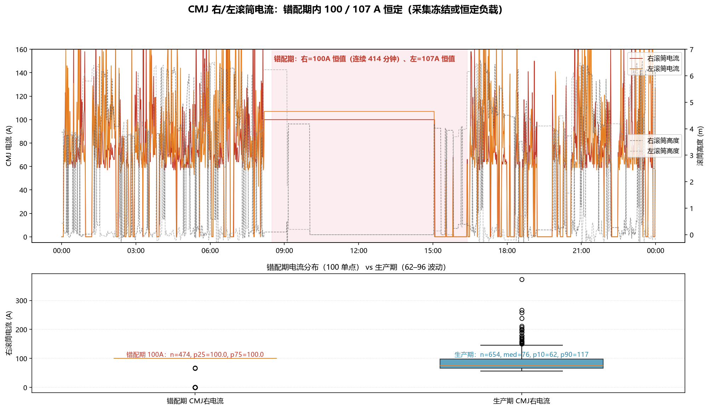

# 04-15 转载机 6.5 小时停摆事件 · 数据内部深度核查

> 阶段三遗留案例回查：`采煤-转载错配` 最长一次事件（2024-04-15 08:30–15:04，联合工况标记 6.5h）
> 核查方法：system_table（分钟级） + 原始长表流式抽取的**母线电压**（秒级）交叉对齐
> 核查人：V · 日期：2026-08-18

---

## 结论（先说）

**这是一起真实的设备停摆事件，机制被母线电压数据重构了：**

1. **08:30 转载机主回路断电**（非电网停电、非软停车）：母线电压从 4600V+ 匀速放电归零，4 分钟放完——典型的变频器主电源断开后的电容放电曲线。
2. **随后 6.5 小时变频器基本处于失电状态**，操作/维修人员至少 **11 轮试送电**（08:30–15:47），每轮都是「上电→充电到 ~4900V→低速微转或空转→再次跳闸放电」。
3. **链条始终无法正常起动**：试机期间链条只能以 **8% 满速**（152–159/1870）微转，电流 59–94A——**不是堵转大电流**（正常生产电流 64–88A），更像变频器起动保护/限速模式下的带不动。
4. **真正恢复是 16:23**，阶梯分档升速（338→524→790→1478→1870，历时 23 分钟）——操作员谨慎试机，非故障排除后的正常启动。
5. **规则标记的 15:04「恢复」是伪恢复**：ZZJ 出现 >0 低速活动即被判「运行」，实际故障延续到 16:23。

最可能的物理原因：**机械卡阻（刮板链卡死/压死）或变频器起动保护**，需维修工单/现场记录佐证（本项目无工单数据，仅能从数据侧给出证据链）。

---

## 一、事件时间线（数据实测）

| 时刻 | 母线电压 | 链条速度 | 解读 |
|---|---|---|---|
| 08:20 | 得电 4600+ | 1872 满速 | 正常生产（I=67A） |
| **08:30** | 开始放电 | **骤停 0** | **主回路断电**，无减速过程，直接跳零 |
| 08:31→08:36 | 4685→53V | 0 | **电容放电曲线**（约 -90V/秒），主电源已断开 |
| 08:36→09:19 | ≈0 | 0 | **完全失电 43 分钟** |
| 09:19→10:02 | 充→4900→放→0 | 152–159 微转 | 试送电#3，链条低速微转 14 个分钟点后跳闸 |
| 10:46→11:07 | 同上 | 微转 1 点 | 试送电#4 |
| 11:34→11:39 | 同上 | 0 | 试送电#5，空转即跳 |
| 13:35→13:41 | 同上 | 0 | 试送电#6 |
| 14:01→14:02 | 峰值 5997V | 0 | 试送电#7，**仅 1 分钟**（过压？） |
| 14:12→14:29 | 充放电 3 轮 | 0 | 试送电#8 #9 |
| 14:31→14:42 | 充放电 | 微转 2 点 | 试送电#10（链 146–161，I=88–94A） |
| 15:07→15:47 | 充放电 3 轮 | 微转 1–3 点 | 试送电#11 #12（链 16/154/160/42） |
| 15:47→16:23 | ≈0 | 0 | 再次完全失电 36 分钟 |
| **16:23→16:46** | 得电 | 338→524→790→1478→1870 | **恢复**：阶梯分档升速，每级停留数分钟 |

> 试送电轮次按母线电压 >100V 的连续时段划分（见附表）。

## 二、核心证据：母线电压的充放电循环

**图5** 04-15 全天四联时间线：联合工况（红=错配）/ 母线电压（紫）/ ZZJ 链条+电流 / CMJ 电流+速度。
可见 08:30 前母线持续得电，08:30 放电归零，09:19 起出现密集的「充电-放电」梳状波（即试送电循环），16:23 后才持续得电。

**图6** 错配窗口放大（08:00–17:00）：母线电压每次充电到 ~4900V 都是操作员的一次试送电，1–43 分钟内又放电归零（跳闸）。故障区间（08:30–16:23，红底）内至少 10 次标注轮次，链条只以 8% 低速微转。

**为什么这排除了「电网停电」和「软停车」：**
- CMJ 全程有电（持续割煤），同一条供电线路上不可能只有 ZZJ 掉电 → 非全矿停电；
- 母线是**匀速放电**（-90V/s，4 分钟归零）而非瞬时跳零 → 主接触器断开后电容经放电电阻自然放电，符合**人为断电或跳闸**；
- 若为电机堵转保护，变频器通常输出限流+反复重启，母线应在 4000V 附近波动而非归零 → 归零意味着**输入侧被切断**，不是单纯过载。

## 三、链条速度：低速微转，不是堵转大电流

- 故障期链条速度 152–159（8% 满速），电流 59–94A，转矩 16–33；
- 正常生产电流 64–88A —— 试机电流与正常生产**几乎重叠**，没有出现堵转时数百安的冲击电流；
- 链速 47–161 这类中间值在全月链条速度分布中占 0.9%（全月 1020 个 unique 值，0 占 38.5%，满速窄带 1705–1881）——**低速值是试机/爬行特征，不是正常运行形态**。

**解读**：变频器能上电、能低频起动（链条微转），但一升速就跳闸。两种可能：
1. **机械卡阻**：刮板链卡死/煤压死/链变形，负载力矩超变频器输出能力 → 起动保护；
2. **电气故障**：变频器输出级/编码器/控制板异常，进入限速保护模式。

无工单数据，两者不能从数据侧严格区分。共同点是：**起动失败循环 6.5 小时**。

## 四、CMJ 侧：全程割煤，电流恒值存疑

**图7** CMJ 右/左滚筒电流 + 滚筒高度（上）+ 错配期 vs 生产期电流分布对比（下）。

- CMJ 在 ZZJ 停摆的 6.5 小时内**持续割煤**（右/左电流恒 100/107A，连续 414 分钟）；
- 100/107A 是**绝对恒值**（unique 值极少），与生产期 62–96A 的波动形态完全不同；
- 04-01~04-13 的错配段右电流中位数 72A，=100 占比仅 0.8% —— 04-15 的恒值**不是全局常态**；
- 滚筒高度 08:30–10:02 从 (0.1, 6.2) 翻转到 (4.2, 0.2)（端头换向），**10:02 起双滚筒落 0.0 持续到 15:02**（割到接近底板？），15:02 后抬起。

**两种解释**（数据不可分）：
1. **采集冻结**：ZZJ 停摆期间 CMJ 遥测链路冻结，电流/高度停在某值；
2. **恒定负载运行**：CMJ 恒速恒压割煤，电流被调速器钳制在设定值。

无论哪种，**CMJ 侧在 6.5h 内的遥测可信度都存疑**——后续若做 CMJ 行为分析应跳过 04-15 错配段。

## 五、对阶段三规则的意义

1. **「采煤-转载错配」规则正确捕获了真实事件**——联合工况标签（割煤中 × 空载/停机）在 04-15 的判定与母线电压证据吻合，不是误报；
2. **「恢复」判定存在伪恢复边界**：15:04 后 ZZJ 以 8% 低速微转即被判「转载余流/空载循环」，联合工况从错配退出，但实际故障持续到 16:23。低速试机与正常恢复在 `ZZJ_LOAD_FEATURES`（链条速度>0 判运行）下不可区分；
3. **改进建议**：将「链条速度低于满速阈值（如 <20% 满速）视为无效运行」纳入工况判定，可避免把试机/爬行误判为恢复——错配事件长度会从 6.5h 修正为 7.9h（08:30–16:23）。

## 六、数据与方法

- `output/phase3/data/system_table.parquet`：联合宽表，分钟级，2024-04-01~04-28；
- `output/phase3/data/zzj_bus_0415.parquet`：04-15 母线电压，秒级，从 1.9GB 原始长表（`data/zzj-20240401-20240601（转载机）/zzj-20240401-20240601.csv`）流式抽取（point_name 含「母线电压」）；
- 分析脚本：`_analyze_mismatch_0415*.py`、`_pull_bus_0415.py`、`_viz_mismatch_0415.py`（归档于 `_archive/`）。

## 附表：母线电压试送电轮次明细（>100V 连续时段）

| # | 时段 | 时长(min) | 峰值V | 期间链条>0 点数 |
|---|---|---|---|---|
| 2 | 01:12–08:36 | 444 | 4969 | 438（正常生产段） |
| 3 | 09:19–10:02 | 43 | 5006 | 14 |
| 4 | 10:46–11:07 | 21 | 4984 | 1 |
| 5 | 11:34–11:39 | 5 | 4975 | 0 |
| 6 | 13:35–13:41 | 6 | 4901 | 0 |
| 7 | 14:01–14:02 | 1 | 5997 | 0 |
| 8 | 14:12–14:17 | 5 | 3464 | 0 |
| 9 | 14:23–14:29 | 6 | 4985 | 0 |
| 10 | 14:31–14:42 | 11 | 4980 | 2 |
| 11 | 15:08–15:17 | 9 | 5002 | 1 |
| 12 | 15:31–15:47 | 16 | 4956 | 3 |
| 13 | 16:23–18:04 | 101 | 4917 | 91（恢复段） |

> #1 为 00:00–01:00 凌晨生产段；#14–#21 为 18:04 后的正常生产，略。
