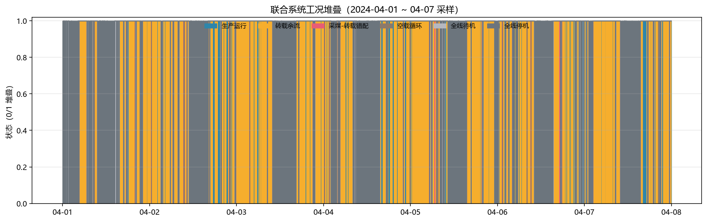
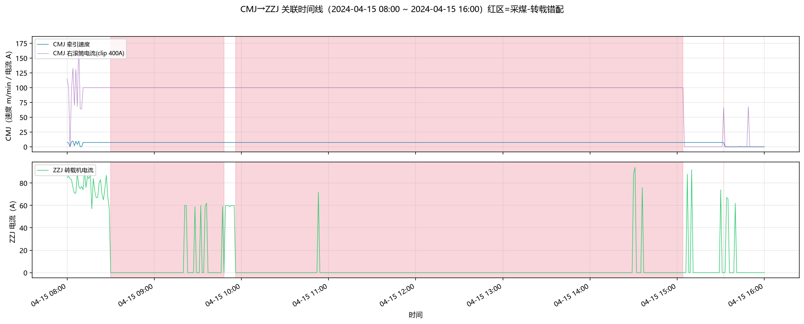
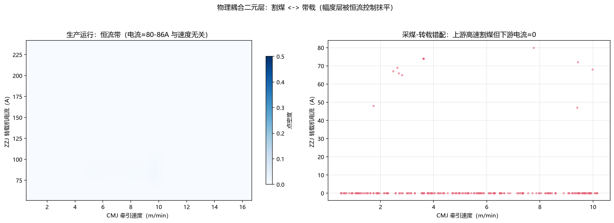
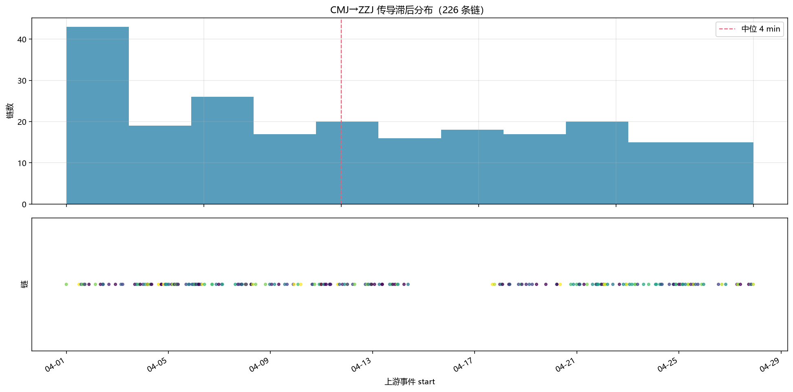

# 阶段三周报：跨设备关联异常检测（CMJ → ZZJ）

**周期**：2026-08-01 ~ 08-11 · **阶段**：三 · **核心问题**：采煤机（CMJ）→ 转载机（ZZJ）物理耦合关系下的关联异常检测

---

## 一、本阶段目标

挖掘上游采煤机（CMJ）到下游转载机（ZZJ）的物理耦合关系，检测"上游割煤但下游负载不匹配"的**关联异常**——即堵煤 / 卡链 / 断链 / 煤流堆积风险。

运输链物理结构：**CMJ 割煤 → CMJ 破碎机 → 溜槽 → ZZJ 转载机**。

| 角色 | 代理量 | 测点 |
|---|---|---|
| 上游产量（X） | 割煤速度 | 采煤机_牵引部位_采煤机速度 |
| | 截割功率 | 采煤机_截割部位_左/右滚筒_电机_电流 |
| | 截割断面 | 采煤机_截割部位_左/右滚筒_高度 |
| 下游负载（y） | 转载负载 | 三机_转载机_电机_电流 / 转矩 / 链条速度 |

---

## 二、关键发现一：恒流控制下幅度耦合不可学习（诚实报告）

**计划假设**：CMJ 高速割煤 + 高滚筒电流 → ZZJ 高负载电流，回归可学。

**实测结论：幅度层耦合不可学习**。ZZJ 变频器采用**恒流控制**，将转载电机电流维持在设定值附近（生产运行域内量化到 103 个离散档位，中位 86A、IQR[79,94]A），下游电流幅度与上游产量幅度**无关**。

| 验证 | 结果 | 含义 |
|---|---|---|
| 线性回归 R² | 0.074 | 幅度几乎无线性关系 |
| RF 训练 R² | 0.875 | 模型在训练集过拟合 |
| **RF 验证 R²** | **-0.069** | 时间序 holdout 上完全失效 |
| RF 验证 MAE vs y 标准差 | 10.0A vs 12.5A | 预测 ≈ 常数，无信息量 |

> **结论**：生产运行域（正常采煤）内，回归残差异常**不可用**——不是模型不够好，而是恒流控制抹平了幅度耦合。耦合真身在更低层。

## 三、关键发现二：耦合真身在二元开关层 + 规则事件层

恒流控制抹平了**幅度层**，但**开关层**（割煤 ↔ 带载）依然强耦合。由 `设备_工况 × 转载机_工况` 合成联合系统工况：

| 联合工况 | 物理含义 | 关联信号 |
|---|---|---|
| 生产运行 | 割煤中 + 带载 | 正常采煤基线 |
| **采煤-转载错配** | 割煤中 + 空载/停机 | **堵煤 / 断链 / 转载未启动风险** |
| **转载余流** | 停机/待机 + 带载 | 残余煤流 / 转载滞后 |
| 全线停机 / 全线待机 / 空载循环 | 双设备协同空转 | 非异常基线 |

crosstab 验证：**割煤中 → 带载占 96.6%**，物理耦合在开关层真实存在且占主导。

## 四、主检测器：联合工况规则事件

回归不可学后，主检测器切换为**联合工况规则事件**——错配 / 余流标签本身即编码物理规则，无需回归：

| 规则事件 | 段数 | 覆盖点数 |
|---|---|---|
| 采煤-转载错配 | **123 段** | 612 点 |
| 转载余流 | **1532 段** | 6809 点 |

**典型案例（04-15）**：采煤机持续高速割煤，但转载机未带载，**连续 309 分钟长时错配**（08:00 ~ 16:00）——煤流长期堆积在下游设备的显著风险信号。

**图 1**：联合系统工况堆叠（04-01 ~ 04-07 采样）。红色 = 采煤-转载错配，黄色 = 转载余流，可见错配/余流呈零星块状分布——均为可治理的离散风险段，而非系统性失控。

## 五、跨设备 Mahalanobis 关联异常

特征 = CMJ 产量代理（5 维）+ ZZJ 负载（2 维），按联合工况分组，χ² 分位数 α=0.001 判异常。

**特征筛选**：剔除母线电压（开关量双峰）与**链条速度**（开关式恒量重尾，p25~p75=1794~1876 却含 0/2193 极值）——恒量特征污染协方差，实测致异常率 17% 泛滥。剔除后：

| 指标 | 剔除前 | 剔除后 |
|---|---|---|
| 总异常率 | 17% | **6.27%** |
| 生产运行域异常 | 3945 点 | **3 点** |
| 物理不匹配域异常占比 | — | **~95%**（余流 1937 + 错配 315） |

> 剔除后 95% 的跨设备异常集中在物理不匹配域（错配/余流），与规则事件主检测器**互相印证**——Mahalanobis 起佐证作用，不喧宾夺主。

## 六、事件传导关联（CMJ 先行 → ZZJ 跟随）

阶段二单设备异常事件（merged_events）跨设备时间对齐，验证"上游先行 → 下游跟随"方向假设：

| 方向 | 传导率 | 中位滞后 |
|---|---|---|
| **CMJ → ZZJ**（假设方向） | **22.14%** | **4 min** |
| ZZJ → CMJ（反向） | 15.45% | — |

> **方向结论**：CMJ 先行 → ZZJ 跟随 传导率显著高于反向（22.14% vs 15.45%），且中位滞后 4 分钟与煤流物理传播时间量级吻合——"上游事件驱动下游事件"的传导假设成立。

**图 2**：04-15 错配案例双设备时间线。红区 = 错配事件区间：上游 CMJ 速度/电流持续活跃，下游 ZZJ 电流≈0——"上游在割、下游不接"的断流铁证。

**图 3**：产量-负载散点。左：生产运行域 ZZJ 电流挤在 80~86A 恒流带，与上游速度无关（恒流控制直接可视）；右：错配域上游高速割煤但下游电流≈0（关联异常）。

**图 4**：CMJ → ZZJ 事件传导滞后分布。中位滞后约 4 分钟，与煤流从采煤机到转载机的物理传播时间量级一致。

## 七、总结与下一步

**本阶段结论**：
1. ZZJ 恒流控制 → 幅度层耦合不可学（R² ≈ 0），已诚实报告，避免用假回归掩盖真相
2. 耦合真身在**二元开关层**（割煤↔带载 96.6%）→ 主检测器 = **联合工况规则事件**（错配 123 段 / 余流 1532 段）
3. 04-15 案例 **309 分钟连续错配**为显著风险信号，值得深入核查
4. 跨设备 Mahalanobis 剔除恒量特征后与规则事件互相印证（95% 异常落在物理不匹配域）
5. 事件传导确认方向：**CMJ 先行 → ZZJ 跟随**（22.14% vs 15.45%，中位滞后 4min）

**下一步**：
- 对 04-15 长时错配做人工核查（是否有设备故障记录佐证）
- 错配/余流事件与维修工单时间对齐，验证检测精度
- 完善周报，合并小组其他成员成果
